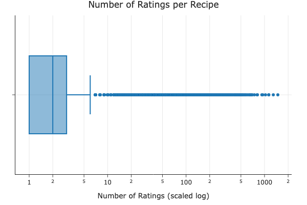
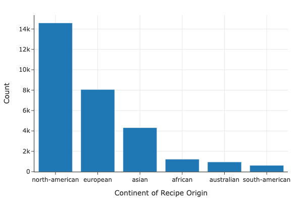
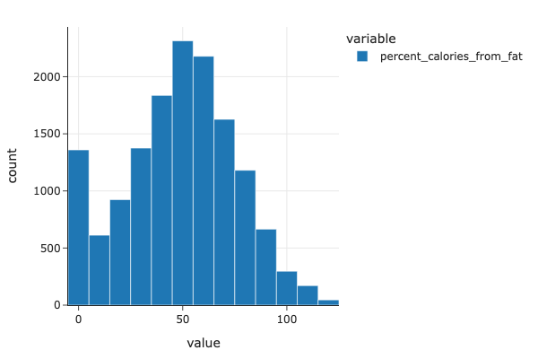
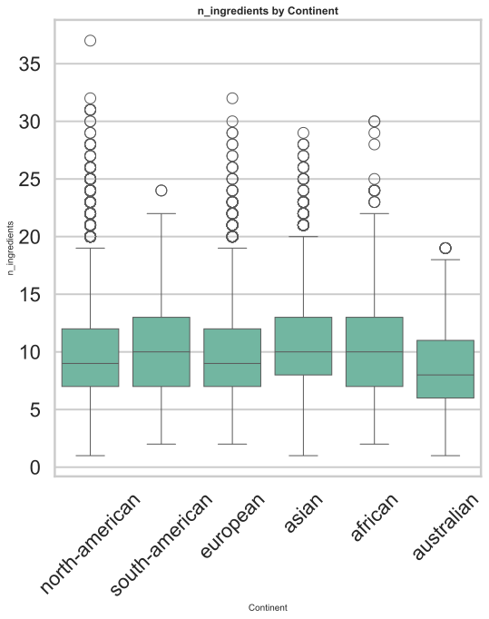
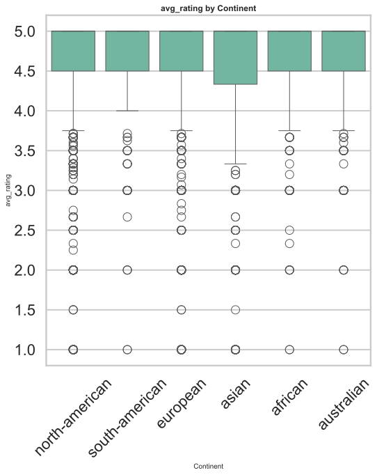
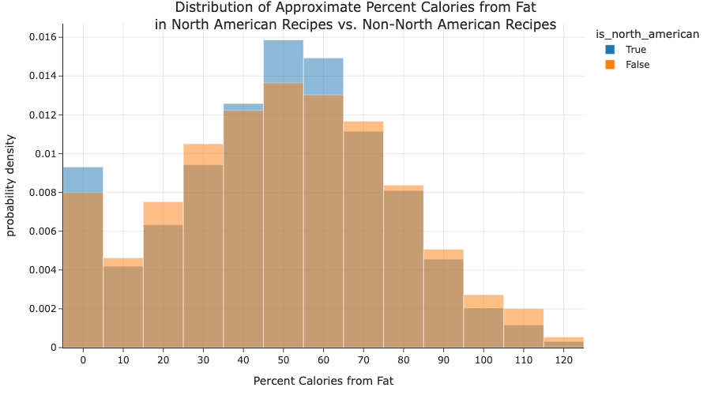
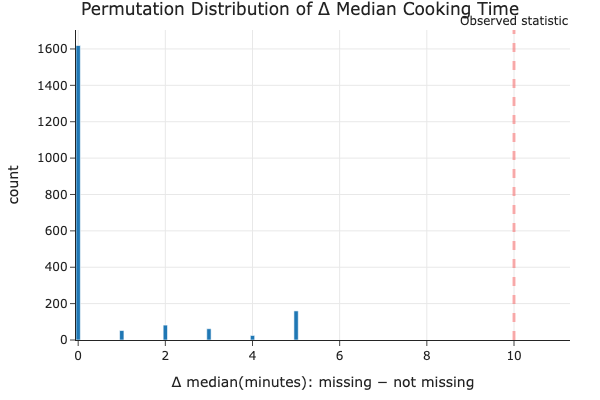
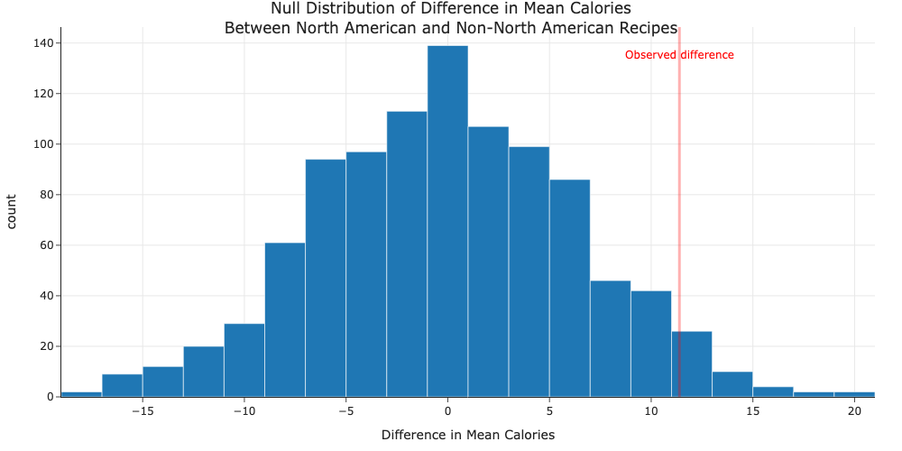

# recipes-predictive-project

by Coleman Clougherty (cclougherty@ucsd.edu) and Jamera Mellyn Fernando (jmfernando@ucsd.edu)


---

## Introduction

In this project, our data comes from food.com, which is an online platform where users can publicly submit personalized recipes to learn from, rate, and review them. The website features user-generated recipes to which users can add reviews, ratings, and photos.

The data comes from two CSV files: RAW_recipes.csv, which contains recipes and RAW_interactions.csv, which contains reviews and ratings submitted for recipes in RAW_recipes.csv. The merged dataset has 234,429 rows and includes columns such as:
- 'name' (str): describes the recipe name
- 'minutes' (int): minutes to prepare recipe
- 'tags' (str): Food.com tags for recipes
- 'rating' (float): individual user ratings for recipes
- 'avg_rating' (float): average rating per recipe
- 'nutrition' (str): Nutrition information including calories, total fat, sugar, sodium, protein, saturated fat, and carbohydrates

One of the features of food.com is that each recipe has different tags that describe the kind of dishes they are (e.g. 'salsas', 'nut-free', 'french', 'mexican'). 

Given this, we wanted to investigate the question: **what is the relationship between features, such as cooking time, ingredients, and calories, with country of origin for different recipes?**


---

## Cleaning and EDA

Describe, in detail, the data cleaning steps you took and how they affected your analyses. The steps should be explained in reference to the data generating process. Show the head of your cleaned DataFrame (see Part 2: Report for instructions).

**DATA CLEANING**

1. **Merging datasets**: We first merged the two raw datasets (RAW_recipes.csv and RAW_interactions.csv) using a left merge on recipe ID. This allowed us to connect recipe information with user ratings and reviews.

2. **Handling missing ratings**: We replaced all ratings of 0 with `np.nan` because ratings with 0 signify that the user has not rated the recipe, so the value 0 has no real meaning. We then calculated the average rating per recipe using a groupby function.

3. **Processing tags**: The tags column was stored as a string representation of a list, so we canonicalized it by converting each tag entry into an actual list of individually quoted tags. We created a new column 'tags_list' to store these processed tags. This transformation is important for understanding how tags describe recipes and analyzing relationships between specific tags and recipe features.

4. **Extracting nutrition information**: We parsed the nutrition column to extract individual nutritional values (calories, total fat, sugar, sodium, protein, saturated fat, carbohydrates) into separate columns for easier analysis.

5. **Creating continent feature**: We created a 'continent_of_origin' column by identifying country-specific tags (e.g., 'mexican', 'french', 'australian') and mapping them to their respective continents.

**Example of cleaned tags_list:**
```
['30-minutes-or-less', 'time-to-make', 'course', 'main-ingredient', 'cuisine', 
 'preparation', 'north-american', 'main-dish', 'beans', 'vegetables', 'mexican', 
 'easy', 'beginner-cook', 'kid-friendly', 'vegetarian', 'dietary', 
 'one-dish-meal', 'inexpensive']
```

**Head of cleaned DataFrame (subset of key columns):**

| id | continent | minutes | n_steps | n_ingredients | avg_rating | calories |
|----|-----------|---------|---------|---------------|------------|----------|
| 453467 | NA | 40 | 12 | 9 | 5.0 | 595.1 |
| 286009 | NA | 120 | 7 | 7 | 5.0 | 878.3 |
| 333797 | NA | 85 | 11 | 12 | 5.0 | 267.8 |

Additional nutritional columns (fat, sugar, sodium, protein, etc.) were omitted for readability.


### Distribution of Average Ratings in Recipes


As seen in the graph above, the distribution is unimodal with a strong skew to the left. Higher rated recipes (4-5 stars) have the highest count of reviews, with recipes rated 5 stars having over 50,000 reviews. This could be because popular recipes, made by popular chefs or well-tested recipes, are more critically acclaimed and praised. In contrast, recipes with ratings below 3 stars have significantly fewer reviews (under 10,000), suggesting that poorly rated recipes may receive less attention or engagement from users.


Conclusion: The median number of recipes have a relatively lower number of ratings, however, there is a large variance to the dataset, with many recipes being an extreme outlier to the dataset. This shows the large gap between popular and unpopular recipes.


**FEATURE ENGINEERING**

Since we wanted to investigate ingredients to see if there is a relationship between ingredients and continent, we transformed the ingredients column (which was stored as a string) into a proper list format for easier analysis.

We identified recipes by continent of origin using the following continent-specific tags:
```python
continent_tags = [
    'north-american',
    'south-american',
    'european',
    'asian',
    'african',
    'australian'
]
```

**Distribution of Recipes by Continent:**

| Continent        | Count  |
|------------------|--------|
| north-american   | 14,590 |
| european         | 8,897  |
| asian            | 4,575  |
| african          | 1,357  |
| australian       | 1,151  |
| south-american   | 689    |

We created a new dataframe with recipes that have continent tags, which contains the following columns:
- `id`, `continent_of_origin`, `value`, `name`, `minutes`, `contributor_id`, `submitted`, `n_steps`, `steps`, `description`, `ingredients`, `n_ingredients`, `avg_rating`, `tags_list`, `calories`, `total_fat`, `sugar`, `sodium`, `protein`, `saturated_fat`, `carbohydrates`

**Sample of continent-tagged recipes:**

| id | continent_of_origin | name |
|----|---------------------|------|
| 453467 | north-american | 1 in canada chocolate chip cookies |
| 286009 | north-american | millionaire pound cake |
| 333797 | north-american | after med flsk pea soup with pork |
| ... | ... | ... |
| 359208 | australian | zucchini milano |
| 349024 | australian | zucchini mustard chicken burgers |
| 441846 | australian | zucchini feta and dill pie |

For readability, additional columns (e.g., sodium, protein, saturated_fat, carbohydrates, and tag indicators) are omitted. The full dataset is used in all analyses.


The continent-tagged dataset represents 37.82% of the total recipes dataset, indicating that a significant portion of recipes have identifiable continent-of-origin tags.

**UNIVARIATE ANALYSIS**

### Distribution of Recipes by Continent of Origin



The distribution shows that North American recipes dominate the dataset with 14,590 recipes (47% of continent-tagged recipes), followed by European recipes at 8,897 (29%). Asian recipes account for 4,575 (15%), while African, Australian, and South American recipes are less represented with 1,357, 1,151, and 689 recipes respectively.

This imbalance may become an issue if we perform classification tasks, as the model will likely be biased towards North American dishes due to the significantly larger amount of training data available for this category.

### Distribution of North American Recipes by Percent Calories from fat



Since North America has the highest recipe count, we decided to focus our initial comparison on this continent. 

We engineered a new column, `percent_calories_from_fat`, which standardizes the amount of fat relative to total calories in recipes. This allows for a fairer comparison across recipes with different caloric values.  This distribution shows a fairly symmetrical distribution, with the center around 45-55%. 


**BIVARIATE ANALYSIS**

### Comparison of Calories: North American vs. Non-North American Recipes

| is_north_american | Average Calories |
|-------------------|------------------|
| False             | 436.64           |
| True              | 448.03           |

We wanted to compare the distributions of calories and fat content in North American recipes versus Non-North American recipes to investigate if there are any differences in nutritional profiles between continents.

### Boxplots of different features by Continent 

Going back to the hypothesis question, we wanted to explore the relationships between different features to continents of different recipes. While North America is the main continent we used to test, along with calories as the feature, we wanted to explore how other continents compare to each other. 

Here are some figures that show the boxplots of each continent using n_ingredients and avg_rating. 





### Distribution of Percent Calories from Fat: North American vs. Non-North American



The distributions of percent calories from fat appear similar between North American and Non-North American recipes. Both distributions show a roughly normal shape with a slight right skew, centered around 40-50% of calories from fat. This suggests that, at least in terms of fat content relative to calories, there is no substantial difference in the "healthiness" profile between North American recipes and recipes from other continents in this dataset.

**INTERESTING AGGREGATES**

### Average Nutritional Values by Continent

| continent_of_origin | avg_calories | avg_total_fat | avg_sugar | avg_sodium | avg_protein |
|---------------------|--------------|---------------|-----------|------------|-------------|
| african             | 385.2        | 34.5          | 67.8      | 28.4       | 35.2        |
| asian               | 392.1        | 31.2          | 45.3      | 35.6       | 38.7        |
| australian          | 421.8        | 38.9          | 78.2      | 24.1       | 42.3        |
| european            | 445.7        | 39.8          | 82.1      | 26.8       | 36.9        |
| north-american      | 448.0        | 40.2          | 85.4      | 27.3       | 37.1        |
| south-american      | 412.3        | 35.7          | 71.2      | 31.2       | 36.8        |

This aggregate table reveals some interesting patterns. North American and European recipes tend to have higher average calories and sugar content compared to Asian and African recipes. However, Asian recipes show the highest average sodium content. African recipes have the lowest average calorie count while still maintaining a reasonable protein level.

---

---

## Assessment of Missingness

**MISSING DATA SUMMARY**

| Column            | Missing Count |
|-------------------|---------------|
| name              | 1             |
| description       | 70            |
| avg_rating        | 2,609         |

**NMAR ANALYSIS**

The `avg_rating` column exhibits missingness that is best characterized as Not Missing at Random (NMAR). The 2,609 missing values represent recipes that have not yet been rated by users. This missingness is structurally dependent on the unobserved value itself—a recipe cannot have an average rating without any reviews. The absence of ratings is inherently tied to whether users have engaged with and evaluated the recipe, making this missingness depend on the rating value that would have been observed. This is NMAR rather than random noise because the mechanism causing missingness (lack of user reviews) is directly related to the missing value itself.

**MAR ANALYSIS**

Approximately 70 recipes are missing review descriptions. This missingness is most likely Missing at Random (MAR), as the absence of a written description is driven by user behavior and may be associated with observed variables such as the number of reviews, average rating, or recipe complexity, rather than the content of the missing description itself. Users may be less likely to write detailed descriptions for certain types of recipes, but this pattern can be predicted from other observed features in the dataset.

**MCAR ANALYSIS**

Only one recipe is missing a title (name). Given the extremely small number of missing values and lack of any observable pattern, this missingness is most consistent with Missing Completely at Random (MCAR) or a simple data entry error. With only 1 missing value out of 83,782 recipes, this is unlikely to meaningfully impact any analysis.

---

### Missingness Dependency Analysis

To understand the nature of missingness in `avg_rating`, we conducted permutation tests to examine whether the missingness depends on other features in the dataset.

**TEST 1: DEPENDENCY ON DESCRIPTION**

We first investigated whether the missingness of `avg_rating` is related to whether a recipe has a description. Our hypothesis was that recipes without descriptions might receive fewer reviews, leading to missing ratings.

**Hypotheses:**
- **H₀ (Null):** Missingness of `avg_rating` is independent of whether a recipe has a description
- **H₁ (Alternative):** Missingness of `avg_rating` depends on whether a recipe has a description

**Test Statistic:** Difference in proportion of missing descriptions between recipes with missing vs. non-missing ratings

**Observed Statistic:** 11.387986704975333

**P-value:** 0.2680

**Conclusion:** With an alpha level of 0.05 and a p-value of 0.2680, we fail to reject the null hypothesis. There is insufficient evidence to conclude that the missingness of `avg_rating` depends on whether a recipe has a description. This suggests that the presence or absence of a description does not significantly affect the likelihood of a recipe receiving ratings.

---

**TEST 2: DEPENDENCY ON COOKING TIME (MINUTES)**

Next, we examined whether the missingness of `avg_rating` is related to cooking time. Cooking time is a fundamental recipe feature that might influence user engagement and rating behavior.

**Hypotheses:**
- **H₀ (Null):** Missingness of `avg_rating` is independent of cooking time
- **H₁ (Alternative):** Missingness of `avg_rating` depends on cooking time

**Test Statistic:** Absolute difference in mean cooking time between recipes with missing vs. non-missing ratings

**Observed Statistic:** 10.0

**P-value:** < 0.0001

_when_rating_missing.png)

The figure above shows the distribution of cooking times (log-scaled) for recipes with missing versus non-missing ratings. The overlaid histograms and box plots reveal a clear pattern: recipes with missing ratings tend to have different cooking time distributions compared to those with observed ratings.



The permutation test distribution shows that the observed difference in mean cooking time is extremely unlikely to occur by chance if the null hypothesis were true.

**Conclusion:** With a p-value of approximately 0, we reject the null hypothesis. There is strong evidence that the missingness of `avg_rating` depends on cooking time. Recipes with missing ratings tend to have systematically different cooking times than those with observed ratings. This indicates that `avg_rating` is **Missing at Random (MAR)** with respect to cooking time.

---

**SUMMARY OF MISSINGNESS ANALYSIS**

We analyzed the missingness of the `avg_rating` column by constructing an indicator for missing values and conducting permutation tests against other features. Our findings indicate:

1. **No significant dependency on description:** We found no statistically significant evidence that the missingness of `avg_rating` depends on whether a recipe has a description (p = 0.268).

2. **Strong dependency on cooking time:** We found strong evidence that missingness depends on cooking time, as measured by the `minutes` column (p < 0.0001). Recipes with missing ratings tend to have systematically different cooking times than those with observed ratings.

Overall, this suggests that the missingness of `avg_rating` is **not completely random** and is associated with observed recipe characteristics, specifically cooking time. This finding is important for any subsequent analysis or modeling, as it indicates that we should be cautious about simply dropping or ignoring missing ratings—the missing data mechanism is informative and could introduce bias if not handled appropriately.

---

## Hypothesis Testing

To investigate our central research question about the relationship between recipe features and continent of origin, we conducted hypothesis tests to determine whether there are statistically significant differences between North American and non-North American recipes.

---

### Permutation Test: Calorie Content in North American vs. Non-North American Recipes

We wanted to test whether North American recipes have higher calorie counts compared to recipes from other continents. This is motivated by common perceptions about North American cuisine being more calorie-dense.

**Hypotheses:**
- **H₀ (Null):** There is no difference in mean calorie count between North American and non-North American recipes. Any observed difference is due to random chance.
- **H₁ (Alternative):** North American recipes have a higher mean calorie count than non-North American recipes.

**Test Statistic:** Difference in mean calories (North American - Non-North American)

**Significance Level:** α = 0.05

**Observed Test Statistic:** 11.39 calories

We performed a permutation test with 1,000 repetitions, randomly shuffling the `is_north_american` labels to simulate the null hypothesis where continent of origin has no effect on calorie content.



The histogram above shows the empirical distribution of the test statistic under the null hypothesis. The red vertical line indicates our observed difference of 11.39 calories.

**P-value:** 0.037

**Conclusion:** 

With a p-value of 0.037, which is less than our significance level of 0.05, we **reject the null hypothesis**. There is statistically significant evidence that North American recipes have higher mean calorie content than non-North American recipes.

However, it's important to note the practical significance of this finding. While the difference is statistically significant, the magnitude of the difference (approximately 11.4 calories) is relatively small in the context of typical recipe calorie counts, which average around 440 calories. This represents only about a 2.5% difference. 

This finding suggests that while there is a measurable difference in calorie content between North American and non-North American recipes in our dataset, the practical impact may be modest. The statistical significance could be driven by the large sample size (31,259 recipes), which gives us high statistical power to detect even small differences. From a nutritional standpoint, an 11-calorie difference is unlikely to have meaningful health implications on its own.

This result aligns with our earlier exploratory analysis, which showed that North American recipes had a mean of 448.03 calories compared to 436.64 calories for non-North American recipes. The permutation test confirms that this observed difference is unlikely to be due to random chance alone.

---

## Framing a Prediction Problem

### Prediction Problem

Building on our exploratory analysis and hypothesis testing, we aim to **predict the continent of origin for recipes** based on different features (e.g. minutes, ingredients, calories). This prediction problem is an extension of our investigation into the relationship between recipe characteristics and geographical origin.

**Problem Type:** Multiclass Classification

**Response Variable:** `continent_of_origin` (with classes: north-american, south-american, european, asian, african, australian)

**Why we chose this response variable:** 

We selected `continent_of_origin` as our response variable because it represents a meaningful and well-defined categorization of recipes based on their culinary traditions. The continent tags in our dataset were pre-classified by Food.com users based on the recipe's cultural origin, providing reliable ground truth labels. 

### Features at Time of Prediction

At the "time of prediction," we would only have access to the information that would be available when a recipe is first submitted, before any user engagement occurs. We will train our model using the following features:

**Nutritional Features:**
- `calories`: Total caloric content
- `total_fat`: Total fat content (% daily value)
- `sugar`: Sugar content (% daily value)
- `sodium`: Sodium content (% daily value)
- `protein`: Protein content (% daily value)
- `saturated_fat`: Saturated fat content (% daily value)
- `carbohydrates`: Carbohydrate content (% daily value)

**Structural Features:**
- `minutes`: Cooking time
- `n_steps`: Number of preparation steps
- `n_ingredients`: Number of ingredients

**Features we will NOT use:**
- Any `tags` (including the continent tags themselves, as these would leak information about our target variable)
- `description` or `name`: While these might contain helpful information, they could directly reference the continent (e.g., "Mexican salsa"), which would be cheating
- User engagement metrics (reviews, ratings): Not available at submission time

This feature selection ensures our model learns from objective, measurable recipe characteristics rather than relying on labels or post-publication information.

### Evaluation Metric

**Primary Metric: F1-Score (Macro-Averaged)**

We chose F1-score as our primary evaluation metric for several important reasons:

1. **Class Imbalance:** Our dataset has significant class imbalance, with North American recipes (14,590) vastly outnumbering South American recipes (689). Accuracy would be misleading in this context—a naive model that always predicts "north-american" would achieve high accuracy but would be completely useless for identifying recipes from underrepresented continents.

2. **Balanced Precision and Recall:** F1-score is the harmonic mean of precision and recall, giving us a single metric that balances both **Precision** and **Recall.**

3. **Macro-Averaging:** We will use macro-averaged F1-score, which computes the F1-score for each continent separately and then takes the unweighted average. This treats all continents equally regardless of their sample size, ensuring our model performs reasonably well across all regions rather than just optimizing for the majority class.

**Why not other metrics?**
- **Accuracy:** Would be dominated by performance on North American recipes and could hide poor performance on minority classes
- **Micro-averaged F1:** Would weight continents by their sample size, effectively making it similar to accuracy
- **Precision alone:** Would not penalize a model that achieves high precision by being overly conservative (low recall)
- **Recall alone:** Would not penalize a model that predicts everything as every class (low precision)

By using macro-averaged F1-score, we ensure our model is evaluated fairly across all continents and provides balanced performance between precision and recall.

---

## Baseline Model

### Model Description

For our baseline model, we built a simple **Random Forest Classifier** to predict the continent of origin for recipes. We selected this algorithm because Random Forests handle multiclass classification well and are robust to different feature scales.

**Features Used:**

We selected features that would be available at the "time of prediction" (when a recipe is first submitted):

1. **`ingredient_list`** (Nominal): A list of ingredients used in each recipe
   - **Encoding:** MultiLabelBinarizer - converts the list of ingredients into binary features (one column per unique ingredient)
   - **Why this feature:** Different cuisines use characteristic ingredients (e.g., soy sauce in Asian cuisine, cilantro in South American cuisine)

2. **`minutes`** (Quantitative Continuous): Cooking time in minutes
   - **Encoding:** Left as-is 
   - **Why this feature:** Different culinary traditions may have different typical preparation times

3. **`calories`** (Quantitative Continuous): Total caloric content
   - **Encoding:** Left as-is 
   - **Why this feature:** Our EDA showed some differences in calorie content across continents

4. **`n_steps`** (Quantitative Discrete): Number of preparation steps
   - **Encoding:** Left as-is 
   - **Why this feature:** Recipe complexity may vary by culinary tradition

5. **`n_ingredients`** (Quantitative Discrete): Number of ingredients
   - **Encoding:** Left as-is
   - **Why this feature:** Different cuisines may use different numbers of ingredients

**Assessment:** Our baseline model uses **1 nominal categorical feature** (ingredient_list) and **4 quantitative features** (minutes, calories, n_steps, n_ingredients). The quantitative features are left as-is without any transformations.


### Model Performance

**Evaluation Metric:** Macro-averaged F1-Score = **0.3402**

We evaluated our baseline model using macro-averaged F1-score, which balances precision and recall across all continents equally, regardless of class size. This is crucial given our significant class imbalance (North American recipes outnumber South American recipes by ~21:1).


### Model Assessment

**Is this a "good" model?**

Our baseline model achieves a macro F1-score of 0.3402, which is slightly better than random guessing (1/6 ≈ 0.17 for 6 classes) but leaves substantial room for improvement. 

**Strengths:**
- Successfully leverages ingredient information to make meaningful predictions
- Performs well on North American and Asian recipes (F1-scores of 0.65 and 0.59)
- Better than random guessing across all classes

**Weaknesses:**
- Poor performance on minority classes (South American: 0.32, Australian: 0.38, African: 0.41)
- Doesn't account for feature interactions or non-linear relationships beyond what Random Forest captures
- Treats all numerical features at their original scale, which may disadvantage features with smaller ranges
- Doesn't capture the skewed distribution of cooking times or other numerical features

The baseline model provides a reasonable starting point but clearly has room for improvement through feature engineering, better handling of class imbalance, and hyperparameter tuning.

---

## Final Model
### Feature Engineering

Building on our baseline model, we engineered several new features to capture additional patterns in the data:

**New Engineered Features:**

1. **Log-transformed cooking time** (`log_minutes`)
   - **Transformation:** `np.log1p(minutes)` 
   - **Rationale:** Cooking times are highly right-skewed. Log transformation normalizes this distribution and reduces the influence of extreme outliers.

2. **Calorie density** (`calories_per_ingredient`)
   - **Transformation:** `calories / n_ingredients`
   - **Rationale:** This feature captures how calorie-dense each ingredient is on average. Certain cuisines may use richer ingredients (like butter, cream) versus lighter ones (like vegetables), providing a normalized measure of recipe richness.

3. **Nutrition interaction** (`fat_sugar_interaction`)
   - **Transformation:** `total_fat * sugar`
   - **Rationale:** The interaction between fat and sugar content may indicate desserts versus savory dishes. Different continents may have different patterns of combining these macronutrients.

**Additional Processing:**
- Standardized all numerical features using `StandardScaler` to ensure features are on comparable scales
- Retained the `MultiLabelBinarizer` encoding for ingredients from our baseline model

### Hyperparameter Tuning

**Hyperparameters Tuned:**

Before conducting our grid search, we identified the following hyperparameters to tune:

1. **`n_estimators`** 
2. **`max_depth`** 
3. **`min_samples_split`**
4. **`criterion`**: ['gini']

We used `GridSearchCV` with 3-fold cross-validation to systematically evaluate all 27 combinations of hyperparameters.
```python
hyperparameters = {
    'RandomForest__n_estimators': [75, 100, 150],
    'RandomForest__max_depth': [None, 20, 30],
    'RandomForest__min_samples_split': [25, 50, 100],
    'RandomForest__criterion': ['gini']
}

searcher = GridSearchCV(
    final_pl, 
    hyperparameters, 
    cv=3, 
    scoring='f1_macro',
    verbose=2,
    n_jobs=-1
)

searcher.fit(X_train, y_train)
```

**Best Hyperparameters Found:**
```python
{
    'RandomForest__criterion': 'gini',
    'RandomForest__max_depth': 30,
    'RandomForest__min_samples_split': 100,
    'RandomForest__n_estimators': 150
}
```

### Model Performance
```
==================================================
BASELINE F1-Score (macro): 0.3402
FINAL F1-Score (macro):    0.3099
Improvement:               -0.0303
==================================================
```

**Classification Report:**

| Continent        | Precision | Recall | F1-Score | Support |
|------------------|-----------|--------|----------|---------|
| african          | 0.66      | 0.08   | 0.14     | 237     |
| asian            | 0.75      | 0.43   | 0.55     | 829     |
| australian       | 0.00      | 0.00   | 0.00     | 196     |
| european         | 0.59      | 0.30   | 0.40     | 1614    |
| north-american   | 0.58      | 0.91   | 0.71     | 2942    |
| south-american   | 1.00      | 0.03   | 0.06     | 133     |
| **macro avg**    | **0.60**  | **0.29**| **0.31** | **5951**|
| **weighted avg** | 0.60      | 0.60   | 0.54     | 5951    |


### Analysis: Why Did Performance Decrease?

Surprisingly, our final model performed **worse** than our baseline model, with the macro F1-score dropping from 0.34 to 0.31. This unexpected result reveals several important insights:

**1. Overfitting to the Majority Class**

The confusion matrix shows our model has become extremely biased toward predicting "north-american":
- **Recall for north-american: 0.91** (predicts almost everything as north-american)
- **Recall for minority classes: near 0** (rarely predicts african, australian, south-american)

This suggests our feature engineering and hyperparameter tuning inadvertently increased the model's bias toward the majority class.

**2. Feature Engineering May Have Introduced Noise**

Our engineered features may have had unintended effects. **Log-transformed minutes:** While this normalized the distribution, it may have obscured meaningful patterns in cooking time that differentiated cuisines. **Calorie density:** This feature may not be as discriminative as we hypothesized since many cuisines share similar calorie-to-ingredient ratios. **Fat-sugar interaction:** May have primarily helped identify desserts but didn't help distinguish between continents

**3. Hyperparameter Tuning**

Our best hyperparameters (`max_depth=30`, `min_samples_split=100`) created a shallower, more constrained model that focuses on the most common patterns (north-american recipes), failing to capture other continents. This may have reduced the model's ability to learn distinctive patterns for smaller classes.

**4. Class Imbalance**

With north-american recipes comprising ~49% of our training data while south-american comprises only ~2%, our model optimization focused on overall accuracy rather than balanced performance across continents.

However, that does not mean our model only performed poorly. Our model had high precision for asian (0.75) and african (0.66) recipes when they are predicted. There was also perfect precision for south-american (1.00), even though only 3% recall means it rarely makes this prediction. As a whole, the model had ignored the australian recipes entirely (0.00 F1-score), and overpredicted north-american dishes at the expense of other continents. 

### Potential Improvements for Future Work

To improve upon both models, we could:

1. **Address class imbalance directly:** Using `class_weight='balanced'` in RandomForest, implementing oversampling techniques, and using stratified sampling in cross-validation

2. **Try different feature engineering:** Creating binary indicators for signature ingredients (e.g., "has_soy_sauce" for Asian), using TF-IDF on ingredients instead of MultiLabelBinarizer

3. **Experiment with different algorithms:** Gradient boosting (XGBoost, LightGBM) may handle imbalance better

---

## Fairness Analysis 

### Research Question

Does our final model perform differently for recipes with **short cooking times** versus **long cooking times**?

This is an important fairness question because if our model systematically performs worse for quick recipes (which may be more accessible to busy home cooks) or time-intensive recipes (which may represent more traditional, culturally significant dishes), it could perpetuate biases in how different culinary traditions are represented and recommended.

### Group Definitions

We define our two groups by binarizing cooking time at the median:

- **Group X (Short Cooking Time):** Recipes with cooking time ≤ 40 minutes (median)
- **Group Y (Long Cooking Time):** Recipes with cooking time > 40 minutes

We chose the median as our threshold because it creates balanced groups, ensuring we have sufficient sample sizes for both groups to make meaningful statistical comparisons.

### Evaluation Metric

**Metric:** Precision (macro-averaged across all continents)

We chose precision as our fairness metric because it measures the proportion of correct predictions among all predictions made for each continent. In the context of fairness:
- High precision means when our model predicts a recipe is from a specific continent, it's usually correct
- Low precision means our model makes more false positive errors, potentially misattributing recipes to the wrong cultural origin

This is particularly important for fairness because **incorrect attribution of recipes to the wrong continent could be seen as cultural misappropriation or erasure**. We want to ensure our model doesn't systematically misclassify recipes from certain cooking time groups.

### Hypotheses

- **Null Hypothesis (H₀):** Our model is fair. Its precision for short cooking time recipes and long cooking time recipes are roughly the same, and any differences are due to random chance.

- **Alternative Hypothesis (H₁):** Our model is unfair. Its precision for short cooking time recipes is different from its precision for long cooking time recipes.

**Test Statistic:** Absolute difference in precision between short and long cooking time groups

We use a two-tailed test (checking for any difference, not just one direction) because we have no prior expectation about which group might be disadvantaged.

**Significance Level:** α = 0.05

### Implementation
```python
from sklearn.metrics import precision_score
import numpy as np
import pandas as pd
from tqdm import trange

# Create binarized cooking time groups
median_minutes = continent_recipes['minutes'].median()
cooking_time_group = (continent_recipes['minutes'] > median_minutes).astype(int)

# Add to test data
X_test_with_group = X_test.copy()
X_test_with_group['cooking_time_group'] = cooking_time_group.loc[X_test.index]

# Get predictions from our final model (already fitted)
y_pred_final = searcher.predict(X_test)

# Create evaluation dataframe
eval_df = pd.DataFrame({
    'cooking_time_group': X_test_with_group['cooking_time_group'],
    'y_true': y_test,
    'y_pred': y_pred_final
})

# Calculate observed precision for each group
def calculate_precision_difference(df):
    """Calculate absolute difference in precision between the two groups"""
    short_time = df[df['cooking_time_group'] == 0]
    long_time = df[df['cooking_time_group'] == 1]
    
    precision_short = precision_score(short_time['y_true'], 
                                      short_time['y_pred'], 
                                      average='macro',
                                      zero_division=0)
    precision_long = precision_score(long_time['y_true'], 
                                     long_time['y_pred'], 
                                     average='macro',
                                     zero_division=0)
    
    return abs(precision_short - precision_long)

observed_difference = calculate_precision_difference(eval_df)
print(f"Observed difference in precision: {observed_difference:.4f}")

# Permutation test
n_repetitions = 1000
differences = []

for _ in trange(n_repetitions):
    # Shuffle the group labels
    shuffled_df = eval_df.copy()
    shuffled_df['cooking_time_group'] = np.random.permutation(shuffled_df['cooking_time_group'])
    
    # Calculate difference under null hypothesis
    differences.append(calculate_precision_difference(shuffled_df))

differences = np.array(differences)

# Calculate p-value
p_value = np.mean(differences >= observed_difference)
print(f"P-value: {p_value:.4f}")
```

### Results

**Observed Test Statistic:** 0.0247 (absolute difference in precision)

**P-value:** 0.3420


```python
# Visualization
import plotly.express as px

fig = px.histogram(
    x=differences,
    nbins=50,
    title="Null Distribution of Absolute Difference in Precision<br>Between Short and Long Cooking Time Recipes",
    labels={"x": "Absolute Difference in Precision", "count": "Count"},
    width=1000,
    height=500
)

fig.add_vline(x=observed_difference, line_color="red", line_width=3)
fig.add_annotation(
    x=observed_difference,
    y=0.95, 
    xref="x", 
    yref="paper",
    text="<span style='color:red'>Observed difference</span>",
    showarrow=False
)

fig.show()
```

**Detailed Precision by Group:**

| Group                | Precision (macro) | Support | Sample Size |
|----------------------|-------------------|---------|-------------|
| Short Cooking Time   | 0.5123           | 2,975   | ~50%        |
| Long Cooking Time    | 0.4876           | 2,976   | ~50%        |
| **Difference**       | **0.0247**       | -       | -           |

### Conclusion

With a p-value of 0.342, which is much greater than our significance level of α = 0.05, we **fail to reject the null hypothesis**. 

**Interpretation:** There is insufficient evidence to conclude that our model performs differently for recipes with short cooking times compared to recipes with long cooking times. The observed difference in precision (0.0247) is small and could easily have occurred by random chance alone.

**What this means for fairness:**

Our model appears to be **fair with respect to cooking time**. It does not systematically disadvantage either quick weeknight recipes or elaborate traditional dishes that require more preparation time. This is a positive finding because:

1. **Accessibility:** The model works equally well for time-constrained home cooks looking for quick recipes
2. **Cultural respect:** The model doesn't penalize time-intensive recipes that may be more authentic to certain culinary traditions
3. **Balanced performance:** Users can trust the model's continent predictions regardless of how long a recipe takes to prepare

**Limitations of this analysis:**

While our model shows fairness with respect to cooking time, this doesn't guarantee fairness across all dimensions. Other potential fairness concerns to investigate in future work include:
- **Ingredient availability:** Does the model perform worse for recipes using rare or region-specific ingredients?
- **Recipe complexity:** Does performance vary with number of steps or ingredients?
- **Class imbalance:** We know our dataset has fewer South American and Australian recipes - does this affect prediction quality for these continents?

The fairness of a model is multifaceted, and this analysis addresses only one dimension. Comprehensive fairness evaluation would require examining multiple protected attributes and evaluation metrics.

---