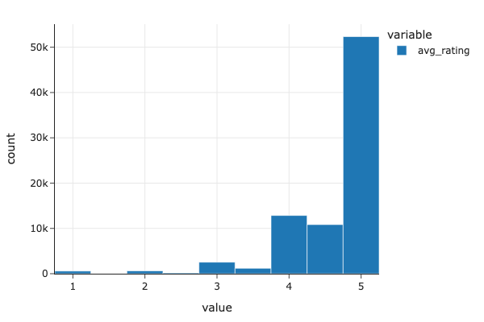

# recipes-predictive-project

by Coleman Clougherty (cclougherty@ucsd.edu) and Jamera Mellyn Fernando (jmfernando@ucsd.edu)


---

## Introduction

In this project, our data comes from food.com, which is an online platform where users can publicly submit personalized recipes to learn from, rate, and review them. The website features user-generated recipes to which users can add reviews, ratings, and photos.

The data comes from two CSV files: RAW_recipes.csv, which contains recipes and RAW_interactions.csv, which contains reviews and ratings submitted for recipes in RAW_recipes.csv. The merged dataset has 234,429 rows and includes columns such as:
- 'name' (str): describes the recipe name
- 'minutes' (int): minutes to prepare recipe
- 'tags' (str): Food.com tags for recipes
- 'rating' (float): individual user ratings for recipes
- 'avg_rating' (float): average rating per recipe
- 'nutrition' (str): Nutrition information including calories, total fat, sugar, sodium, protein, saturated fat, and carbohydrates

One of the features of food.com is that each recipe has different tags that describe the kind of dishes they are (e.g. 'salsas', 'nut-free', 'french', 'mexican'). 

Given this, we wanted to investigate the question: **what is the relationship between features, such as cooking time, ingredients, and calories, with country of origin for different recipes?**


---

## Cleaning and EDA

Describe, in detail, the data cleaning steps you took and how they affected your analyses. The steps should be explained in reference to the data generating process. Show the head of your cleaned DataFrame (see Part 2: Report for instructions).

**DATA CLEANING**

1. **Merging datasets**: We first merged the two raw datasets (RAW_recipes.csv and RAW_interactions.csv) using a left merge on recipe ID. This allowed us to connect recipe information with user ratings and reviews.

2. **Handling missing ratings**: We replaced all ratings of 0 with `np.nan` because ratings with 0 signify that the user has not rated the recipe, so the value 0 has no real meaning. We then calculated the average rating per recipe using a groupby function.

3. **Processing tags**: The tags column was stored as a string representation of a list, so we canonicalized it by converting each tag entry into an actual list of individually quoted tags. We created a new column 'tags_list' to store these processed tags. This transformation is important for understanding how tags describe recipes and analyzing relationships between specific tags and recipe features.

4. **Extracting nutrition information**: We parsed the nutrition column to extract individual nutritional values (calories, total fat, sugar, sodium, protein, saturated fat, carbohydrates) into separate columns for easier analysis.

5. **Creating continent feature**: We created a 'continent_of_origin' column by identifying country-specific tags (e.g., 'mexican', 'french', 'australian') and mapping them to their respective continents.

**Example of cleaned tags_list:**
```
['30-minutes-or-less', 'time-to-make', 'course', 'main-ingredient', 'cuisine', 
 'preparation', 'north-american', 'main-dish', 'beans', 'vegetables', 'mexican', 
 'easy', 'beginner-cook', 'kid-friendly', 'vegetarian', 'dietary', 
 'one-dish-meal', 'inexpensive']
```
**Head of cleaned DataFrame:**

| id      | continent_of_origin | name                              | minutes | n_steps | n_ingredients | avg_rating | calories | total_fat | sugar | sodium | protein | saturated_fat | carbohydrates |
|---------|---------------------|-----------------------------------|---------|---------|---------------|------------|----------|-----------|-------|--------|---------|---------------|---------------|
| 453467  | north-american      | 1 in canada chocolate chip cookies| 40      | 12      | 9             | 5.0        | 595.1    | 46.0      | 211.0 | 22.0   | 13.0    | 51.0          | 26.0          |
| 286009  | north-american      | millionaire pound cake            | 120     | 7       | 7             | 5.0        | 878.3    | 63.0      | 326.0 | 13.0   | 20.0    | 123.0         | 39.0          |
| 333797  | north-american      | after med flsk pea soup with pork | 85      | 11      | 12            | 5.0        | 267.8    | 20.0      | 7.0   | 34.0   | 44.0    | 12.0          | 0.0           |

### Distribution of Average Ratings in Recipes



As seen in the graph above, the distribution is unimodal with a strong skew to the left. Higher rated recipes (4-5 stars) have the highest count of reviews, with recipes rated 5 stars having over 50,000 reviews. This could be because popular recipes, made by popular chefs or well-tested recipes, are more critically acclaimed and praised. In contrast, recipes with ratings below 3 stars have significantly fewer reviews (under 10,000), suggesting that poorly rated recipes may receive less attention or engagement from users.


---

## Assessment of Missingness
**NMAR**
There is no column that explicitly shows NMAR. However, the column with the most missing data, which is 'avg-rating' is Missing By Design. This is because ratings with 0 stars is equivalent to ratings with no ratings at all, hence the user not scoring the recipe yet. Therefore, any recipes with an average rating of 0 just means that the recipe has no reviews yet. 


Here's what a Markdown table looks like. Note that the code for this table was generated _automatically_ from a DataFrame, using

```py
print(counts[['Quarter', 'Count']].head().to_markdown(index=False))
```

| Quarter     |   Count |
|:------------|--------:|
| Fall 2020   |       3 |
| Winter 2021 |       2 |
| Spring 2021 |       6 |
| Summer 2021 |       4 |
| Fall 2021   |      55 |

---

## Hypothesis Testing


---
